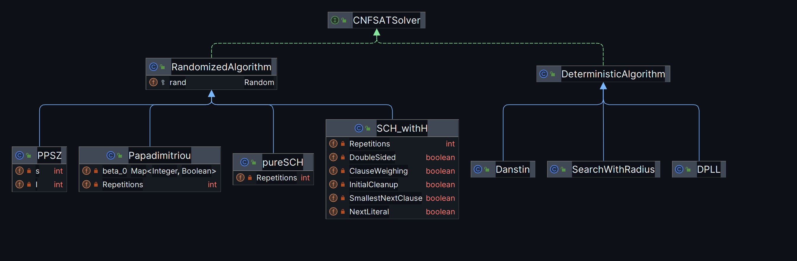

This project is a collection of various algorithms implemented in Java   (another version in c may follow) 
to solve the Boolean Satisfiability Problem (SAT).
It includes classic deterministic algorithms and
stochastic local search methods. 
The program is designed to parse boolean formulas in the
DIMACS CNF format and determine if they are satisfiable.
Instances are taken from https://www.cs.ubc.ca/~hoos/SATLIB/benchm.html.

##   Parsing  and Formatting  Parsing 
For the  parsing of the formulas in DIMACS format, the class ParseCnf can be used
it currently contains the  functions :
* parseCnf(String filePath, int MaxN, int MAxC) :  parses a formula in DIMACS format, but limit the number of variables
to MaxN, and the number of literals in each clause to MaxC.

*   ReadCNFFilePath() : a simple wrapper for a reader that would read a filepath to cnf formula
###   Formatting 
formulas are defined as CnfFormula objects , they contain 5 components
* Type : gives the maximum number of variables throughout the clauses
* A List of clauses (which in turn are lists of literals )
* A set of variables : the variables present in the formula
* the number of variables
* the number of clauses
##   Presented algorithms 
In this project a variation randomized and deterministic algorithms is applied.
They all implement the interface CNFSATSolver in which common needed procedures are defined.
The following UML diagram show the structure of the currently presented algorithms, with a more thorough description below.
It will be extended with the other algorithms, once they are implemented

###  Randomized Algorithms 
They all inherit the class RandomizedAlgorithms and heavily  rely on functions defined there. \
Presented algorithms :
* Papadimitirou's algorithm : implement papadimitriou's algorithm for 2-SAT
  (A simple and elegant randomized algorithm which "only" run in quadratic time)
* Schoening's algorithm : a simple algorithm implemented in two different classes 
  * pureSCH : here the pure algorithm based on complete randomness is presented
  * SCH_withH : some other heuristics are added to the algorithm
* PPSZ :  improvement on the previous algorithm that uses resolution
* Hertli : to be implemented

###    Deterministic Algorithms 
* DPLL : Davis-Putnam-Logemann-Loveland: A classic, complete, 
backtracking-based algorithm that is guaranteed to find a solution.
* Danstin and al. : A deterministic algorithm for k-SAT that runs in O((1.5)^n) for 3-SAT and is based on derandomization.
* Moser-Scheder : to be implemented
* Liu : to be implemented

